<center><h1>离散数学</h1></center>

<div style="border-bottom: none;"><center><h3>目录</h3></center></div>

[TOC]

<div style="page-break-after: always;"></div>

## 1.5 证明

**证明（Proof）**

证明方法非常重要，不仅因为它们可用于证明数学定理，而且在计算机科学中也有许多应用，包括验证程序正确性、建立安全的操作系统、人工智能领域做推论等。证明就是建立定理真实性的有效论证。

证明定理有很多方法：

1. 直接证明法（direct proof）

---

【范例】证明定理：如果$ n $是奇数，那么$ n^2 $也是奇数，$ n \in \Z $。
$$
\forall_x (P(n) \rarr Q(n)) \\
\\
\begin{aligned}
n^2 &= (2k + 1)^2 \\
	&= 4k^2 + 4k + 1 \\
	&= 2(2k^2 + 2k) + 1
\end{aligned}
$$

---

2. 反证法（proof by contrapositive）：由于$ p \rarr q \equiv \neg q \rarr \neg p $，因此可以通过证明原命题的逆否命题来反证原命题。

---

【范例】证明定理：如果$ xy $是偶数，那么$ x $是偶数或$ y $是偶数，$ x, y \in \Z $。

逆否命题：如果$ x $是奇数并且$ y $是奇数，那么$ xy $是奇数，$ x, y \in \Z $。
$$
\begin{aligned}
xy &= (2m + 1)(2n + 1) \\
   &= 4mn + 2m +2n + 1 \\
   &= 2(2mn + m + n) + 1
\end{aligned}
$$

---

<div style="page-break-after: always;"></div>

## 1.6 布尔代数

**布尔代数（Boolean Algebra）**

计算机和其它电子设备中的电路都有输入和输出，输入是`0`或`1`，输出也是`0`或`1`。电路可以用任何具有两个不同状态的基本元件来构造，例如开关和光学装置就是这样的原件，开关可位于开或关的位置，光学装置可能是点亮或未点亮。18世纪，乔治·布尔（George Boole）给出了逻辑的基本规则。

电路的操作可以用布尔函数来定义，这样的布尔函数对任意一组输入都能指出其输出的值。

布尔代数提供的是集合$ \{0, 1\} $上的运算和规则，布尔代数的规则类似于命题逻辑的规则。`1`相当于逻辑中的`真`，`0`相当于逻辑中的`假`。

布尔代码运算主要有三种：

1. 补（complement）

|  x   | $ \overline x $ |
| :--: | :--------: |
|  1   |     0      |
|  0   |     1      |

2. 布尔积（boolean multiplication）

| $ x $ | $ y $ | $ x \cdot y$ |
| :---: | :---: | :----------: |
|   1   |   1   |      1       |
|   1   |   0   |      0       |
|   0   |   1   |      0       |
|   0   |   0   |      0       |

3. 布尔和（boolean addition）

| $ x $ | $ y $ | $ x + y$ |
| :---: | :---: | :------: |
|   1   |   1   |    1     |
|   1   |   0   |    1     |
|   0   |   1   |    1     |
|   0   |   0   |    0     |

---

【范例】布尔表达式

当$ x = y = 1 $，$ w = z = 0 $时，

$ x \cdot y + (w + z) = 1 \cdot 1 + (0 + 0) = 1 + 0 = 1 $

$ x \cdot \overline y + z \cdot \overline{(w + z)} = 1 \cdot \overline 1 + 0 \cdot \overline{(0 + 0)} = 0 + 0 = 0 $

$ x \cdot \overline y + \overline{(\overline x + y + \overline{yz})} = 1 \cdot \overline 1 + \overline{(\overline 1 + 1 + \overline{1 \cdot 0})} = 0 + \overline 1 = 0 $

---


**布尔代数定理**

| 定理                          |                           等价关系                           |
| :---------------------------- | :----------------------------------------------------------: |
| 幂等律（Idempotent Laws）     |               $$ x \cdot x = 0 \\ x + x = x $$               |
| 恒等律（Identity Laws）       |               $$ x \cdot 1 = x \\ x + 0 = x $$               |
| 支配律（Domination Laws）     |               $$ x \cdot 0 = 0 \\ x + 1 = 1 $$               |
| 双非律（Double Negation Law） |                    $ \overline {\overline x} = x $                     |
| 交换律（Commutative Laws）    |         $$ x \cdot y = y \cdot x \\ x + y = y + x $$         |
| 结合律（Associative Laws）    | $$ (x \cdot y) \cdot z = x \cdot (y \cdot z) \\ (x + y) + z = x + (y + z) $$ |
| 分配率（Distributive Laws）   | $$ x \cdot (y + z) = x \cdot y + x \cdot z \\ x + (y \cdot z) = (x + y) \cdot (x + z) $$ |
| 德摩根律（De Morgan's Laws）  | $$ \overline{x \cdot y} = \overline x + \overline y \\ \overline{x + y} = \overline x \cdot \overline y $$ |
| 吸收律（Absorption Laws）     |       $$ x \cdot (x + y) = x \\ x + (x \cdot y) = x $$       |

---

【范例】证明$ xy + x \overline y = x $
$$
\begin{aligned}
& xy + x \overline y \\
&= x \cdot (y + \overline y) \\
&= x \cdot 1 \\
&= x
\end{aligned}
$$

---


**布尔函数（Boolean Function）**

含有$ n $个变量的布尔函数能够构造出$ 2^n $行的输入输出表。

---

【范例】计算$ F(x, y, z) = xy + \overline z $

| $ x $ | $ y $ | $ z $ | $ F(x, y, z) $ |
| :---: | :---: | :---: | :------------: |
|   0   |   0   |   0   |       1        |
|   0   |   0   |   1   |       0        |
|   0   |   1   |   0   |       1        |
|   0   |   1   |   1   |       0        |
|   1   |   0   |   0   |       1        |
|   1   |   0   |   1   |       0        |
|   1   |   1   |   0   |       1        |
|   1   |   1   |   1   |       1        |

---


**NAND和AND运算符**

`NAND`运算符用$ \uarr $表示`Not And`，$ x \uarr y = \overline{x \cdot y} $。

`NOR`运算符用$ \darr $表示`Not Or`，$ x \darr y = \overline{x + y} $。

<div style="page-break-after: always;"></div>

## 1.7 逻辑门电路

**逻辑门电路（Logical Gate Circuit）**

基础的逻辑门主要有三种：

1. 与门（AND gate）：

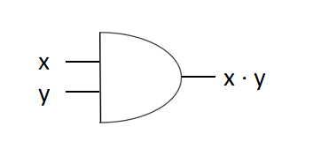

2. 或门（OR gate）：

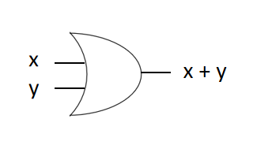

3. 非门（NOT gate）：

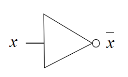

---

【范例】设计一个投票表决电路，三个人中有两人赞成即通过。赞成票为1，否决表为0。
$$
F(x, y, z) = xy + xz + yz
$$
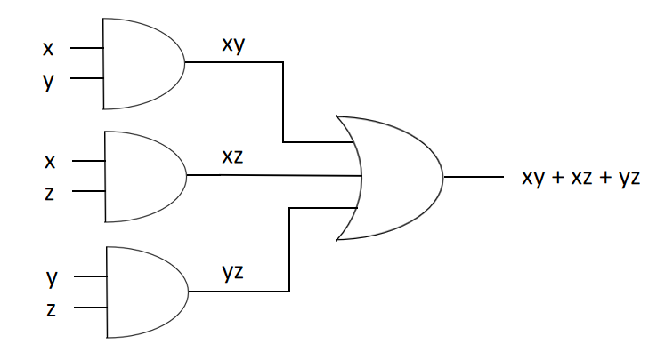

---

<div style="page-break-after: always;"></div>

# 第2章 集合

## 2.1 集合

**集合（Set）**

集合是对象的唯一的、无序的聚集，通常一个集合中的对象都具有相似的性质。对象也称为集合的元素（element）或成员（member）。

通常用大写字母表示集合，小写字母表示元素。$ a \in A $表示是$ a $集合$ A $中的元素，$ a \notin A $表示$ a $不是集合$ A $中的元素。

使用花名册方法（roster method）列出集合中的元素，可以用于描述集合。

---

【范例】花名册方法

小写元音字母集合$ V = \{a, e, i, o, u\} $

小于10的正奇数集合$ O = \{1, 3, 5, 7, 9\} $

小于100的非负整数集合$ A = \{0, 1, 2, 3, \dots, 99\} $

---

集合构造器（set builder）通过描述元素具有的形式来描述集合。

---

【范例】集合构造器

小于10的正整数$ A = \{x | x < 10\} $

---

有一些常用的特殊符号可用于描述指定的集合：

|    符号    | 含义                                                   |
| :--------: | ------------------------------------------------------ |
|   $ \N $   | 自然数集$ \{0, 1, 2, 3, \dots \} $                     |
|   $ \Z $   | 整数集$ \{\dots, -2, -1, 0, 1, 2, \dots \} $           |
|  $ \Z^+ $  | 正整数集$ \{1, 2, 3, \dots \} $                        |
|   $ \Q $   | 有理数集$ \{p / q |\ p \in \Z,\ q \in Z\ (q \ne 0)\} $ |
|  $ \Q^+ $  | 正有理数集                                             |
|   $ \R $   | 实数集                                                 |
|  $ \R^+ $  | 正实数集                                               |
|   $ \C $   | 复数集                                                 |
| $ \empty $ | 空集$ \{\} $                                           |


**基数（Cardinality）**

基数表示有限集合中元素的个数，集合$ A $的基数记为$ |A| $。

---

【范例】基数

英语字母集合$ A $，$ |A| = 26 $

空集$ \empty $，$ |\empty| = 0 $

---


**韦恩图（Venn Diagram）**

集合还可以使用韦恩图来表示。

全集（universal set）包含所研究问题中所有的元素，用符号$ \bigcup $表示。

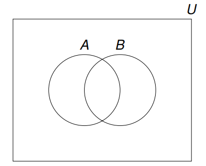

假设有两个集合$ A $和$ B $，如果$ A $中的所有元素都在$ B $中，那么$ A $就是$ B $的子集，表示为$ A \subseteq B $。如果$ A $中有一个元素不在$ B $中，那么$ A $就不是B的子集，表示为$ A \nsubseteq B $。

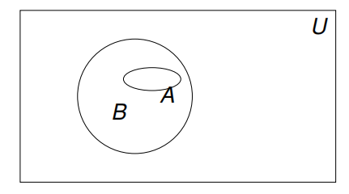

只有当两个集合互相为对方的子集时，那么这两个集合相等，即：
$$
A = B\ \text{iff}\ A \subseteq B\ and\ B \subseteq A
$$
如果$ A \subseteq B $，并且$ B $中有一个元素不是$ A $的元素，那么称$ A $是$ B $的真子集（proper subset），表示为$ A \subset B $。


**幂集（Power Set）**

一个集合中是可以包含另一个集合的，如$ \{\{1\}. \{1,2\}, \{1, 2, 3\}\} $。需要注意，$ 1 \ne \{1\} \ne \{\{1\}\} $。

幂集用于表示一个集合所有子集的集合，集合$ A $的幂集表示为$ P(A) $。

---

【范例】计算$ A = \{1, 2, 3\} $的幂集

$ P(A) = \{\empty, \{1\}, \{2\}, \{3\}, \{1, 2\}, \{1, 3\}, \{2, 3\}, \{1, 2, 3\}\} $

---

如果集合$ A $的基数为$ n $，那么$ A $的幂集的基数为$ 2^n $，即$ |P(A)| = 2^n $。

<div style="page-break-after: always;"></div>

## 2.2 集合运算

**交集（Intersection）**

假设$ A $和$ B $是两个集合，由所有属于$ A $并且属于$ B $的元素所组成的集合，称为$ A $与$ B $的交集，表示为$ A \cap B $。

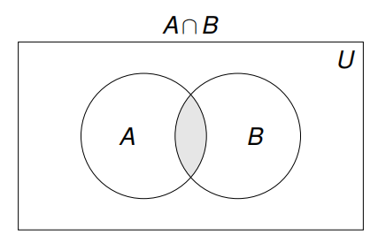

如果两个集合没有公共元素，那么它们的交集为空集。


**并集（Union）**

假设$ A $和$ B $是两个集合，由它们所有元素合并在一起组成的集合，称为$ A $与$ B $的并集，表示为$ A \cup B $。


**差集（Difference）**

假设$ A $和$ B $是两个集合，由属于$ A $而不属于$ B $的元素组成的集合，称为$ A $与$ B $的差集，表示为$ A - B $。

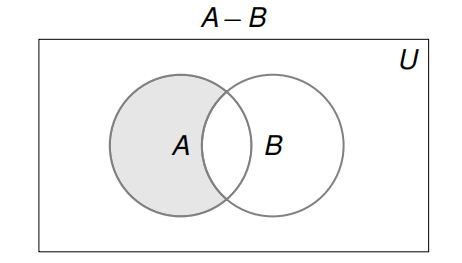

差集运算不满足交换律，即$ A - B \ne B - A $。


**补集（Complement）**

假设$ A $是一个集合，由全集$ \cup $中所有不属于$ A $的元素组成的集合，称为$ A $的补集，表示为$ \overline A $。

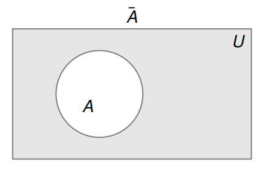

<div style="page-break-after: always;"></div>

## 2.3 集合恒等式

**集合恒等式**

集合恒等式可以直接由对应的逻辑等价式证明。

| 定理                          |                           等价关系                           |
| :---------------------------- | :----------------------------------------------------------: |
| 幂等律（Idempotent Laws）     |              $$ A \cap A = A \\ A \cup A = A $$              |
| 恒等律（Identity Laws）       |           $$ A \cap U = A \\ A \cup \empty = A $$            |
| 支配律（Domination Laws）     |         $$ A \cap \empty = \empty \\ A \cup U = U $$         |
| 双非律（Double Negation Law） |               $ \overline {\overline A} = A $                |
| 交换律（Commutative Laws）    |       $$ A \cap B = B \cap A \\ A \cup B = B \cup A $$       |
| 结合律（Associative Laws）    | $$ (A \cap B) \cap C = A \cap (B \cap C) \\ (A \cup B) \cup C = A \cup (B \cup C) $$ |
| 分配率（Distributive Laws）   | $$ A \cap (B \cup C) = (A \cap B) \cup (A \cap C) \\ A \cup (B \cap C) = (A \cup B) \cap (A \cup C) $$ |
| 德摩根律（De Morgan's Laws）  |   $$ \overline{A \cap B} = \overline A \cup \overline B $$   |
| 吸收律（Absorption Laws）     |     $$ A \cap (A \cup B) = A \\ A \cup (A \cap B) = A $$     |

---

【范例】证明$ \overline{A \cup (B \cap C)} = (\overline C \cup \overline B) \cap \overline A $
$$
\begin{aligned}
& \overline{A \cup (B \cap C)} \\
&= \overline A \cap \overline{B \cap C} \\
&= \overline A \cap (\overline B \cup \overline C) \\
&= (\overline B \cup \overline C) \cap \overline A \\
&= (\overline C \cup \overline B) \cap \overline A
\end{aligned}
$$

---

【范例】韦恩图

>一共有40个学生，有3门课程可供学生选择（C语言、离散数学、软件工程）。
>
>7人没有选任何课程；
>
>16人选软件工程；
>
>10人选C语言；
>
>5人同时选离散数学和软件工程；
>
>4人同时选离散数学和C语言；
>
>3人同时选软件工程和C语言；
>
>2人同时选离散数学、软件工程和C语言。


---

<div style="page-break-after: always;"></div>

## 2.4 笛卡尔积

**元组（Tuple）**

有时候元素聚集中次序是很重要的，由于集合是无序的，所以就需要一种不同的结构表示有序的聚集，这就是有序$ n $元组（ordered-n-tuple）。

有序$ n $元组$ (a_1, a_2, \dots, a_n) $是以$ a_1 $为第$ 1 $个元素，$ a_2 $为第$ 2 $个元素，$ a_n $为第$ n $个元素的有序聚集。

只有两个有序$ n $元组的每一对对应的元素都相等，那么这两个有序$ n $元组是相等的，即：
$$
(a_1, a_2, \dots, a_n) = (b_1, b_2, \dots, b_n)\ \text{iff}\ i = 1, 2, \dots, n
$$
需要注意，$ (a, b) $与$ (b, a) $不相等，除非$ a = b $。


**笛卡尔积（Cartesian Product）**

假设有两个集合$ A $和$ B $，$ A $和$ B $的笛卡尔积用$ A \times B $表示，笛卡尔积是所有序偶$ (a, b) $的集合，其中$ a \in A $且$ b \in B $。
$$
A \times B = \{(a, b) | a \in A \wedge b \in B\}
$$
笛卡尔积$ A \times B $和$ B \times A $是不相等的，除非$ A = \empty $或$ B = \empty $或$ A = B $。

---

【范例】笛卡尔积

学生集合$ S = \{s1, s2\} $

课程集合$ C = \{c1, c2, c3\} $

$ S \times C = \{(s1, c1), (s1, c2), (s1, c3), (s2, c1), (s2, c2), (s2, c3)\} $

笛卡尔积$ S \times C $表示学生选课的所有可能情况

---

【范例】笛卡尔积$ A \times B \times C $

$ A = \{0, 1\} $

$ B = \{1, 2\} $

$ C = \{0, 1, 2\} $

$$
\begin{aligned}
A \times B \times C = \{(0, 1, 0), (0, 1, 1), (0, 1, 2), (0, 2, 0), (0, 2, 1), (0, 2, 2), \\
						(1, 1, 0), (1, 1, 1), (1, 1, 2), (1, 2, 0), (1, 2, 1), (1, 2, 2)\}
\end{aligned}
$$

---

一个集合与自身的笛卡尔积，如$ A \times A $可表示为$ A^2 $。

---

【范例】笛卡尔积$ A^2 $

$ A = \{1, 2\} $

$ A^2 = \{(1, 1), (1, 2), (2, 1), (2, 2)\} $

---

<div style="page-break-after: always;"></div>

# 第3章 函数

## 3.1 函数

**函数（Function）**

函数在数学和计算机科学中的概念非常重要，在离散数学中函数用于定义像序列和字符串这样的离散结构。

利用一个函数$ f $，可以将一个值$ x \in \R $映射（mapping）到一个特定的值$ y = f(x) $上（$ y \in \R $)。

假设有两个非空集合$ X $和$ Y $，从$ X $到$ Y $的函数$ f $是指对于$ X $的每个元素恰好都对应$ Y $的一个元素（$ f(x) = y,\ x \in X,\ y \in Y $），那么就写成$ f: X \rarr Y $。

集合$ X $被称为函数$ f $的定义域（domain），集合$ Y $被称为函数$ f $的陪域（co-domain）。

如果$ f(x) = y $，那么$ y $是$ x $在函数$ f $下的像（image），$ x $是$ y $在函数$ f $下的原像（pre-image）。函数$ f $的值域（range）是集合$ X $中所有像的集合。

当两个函数$ f $和$ g $有相同的定义域和陪域，并且对于定义域中所有元素$ x $都满足$ f(x) = g(x) $，那么函数$ f $和$ g $相等，表示为$ f = g $。

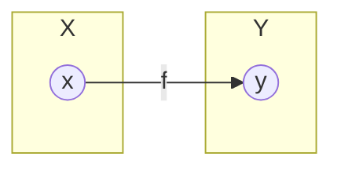

---

【范例】判断是否为函数

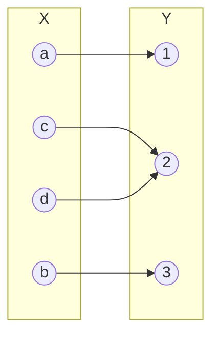

是否为函数：是

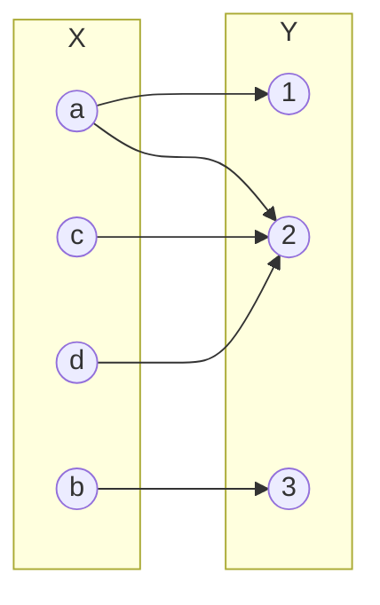

是否为函数：否

---

【范例】函数

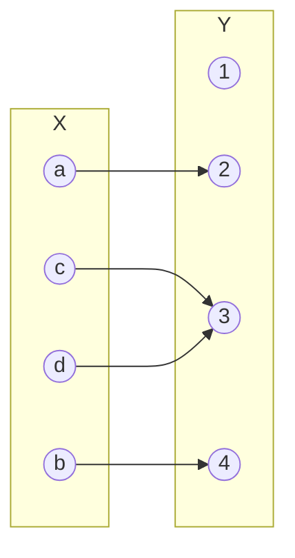

| 是否为函数 | 定义域（domain） | 陪域（co-domain） | 值域（range） |
| :--------: | :--------------: | :---------------: | :-----------: |
|     是     |  $ a, b, c, d $  |  $ 1, 2, 3, 4 $   |  $ 2, 3, 4 $  |

---

<div style="page-break-after: always;"></div>

## 3.2 取整函数

**上取整函数（Ceiling Function）**

取整函数包括上取整和下取整，可以将实数映射到整数（$ \R \rarr \Z $)，它们以不同的方式将实数近似到相邻的整数。

上取整函数将实数$ x $向上取到大于或等于$ x $的最小整数，表示为$ \lceil x \rceil $。

---

【范例】上取整函数

$ \lceil 3.2 \rceil = 4 $

$ \lceil 2.6 \rceil = 3 $

$ \lceil -0.5 \rceil = 0 $

---


**下取整函数（Floor Function）**

下取整函数将实数$ x $向下取到小于或等于$ x $的最大整数，表示为$ \lfloor x \rfloor $。

---

【范例】下取整函数

$ \lfloor 3.2 \rfloor = 3 $

$ \lfloor 5.9 \rfloor = 5 $

$ \lfloor -0.5 \rfloor = -1 $

---

<div style="page-break-after: always;"></div>

## 3.3 函数分类

**一对一函数（One-to-one） / 单射函数（Injection）**

一对一函数 / 单射函数是指对于函数$ f $的定义域中所有的$ a $和$ b $，如果$ a \ne b $，那么$ f(a) \ne f(b) $。

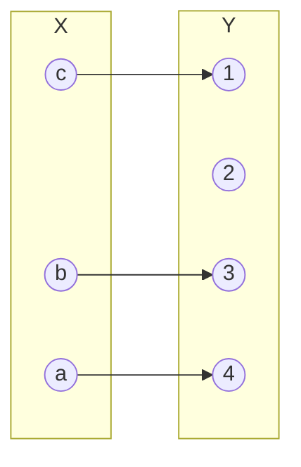

---

【范例】一对一函数 / 单射函数

$ f(x) = x + 1 $是一对一函数。

$ f(x) = x^2 $不是一对一函数，因为$ f(1) = f(-1) = 1 $。

---


**映上函数（Onto） / 满射函数（Surjection）**

映上函数 / 满射函数是指对于函数$ f: A \rarr B $，每个$ b \in B $都有元素$ a \in A $使得$ f(a) = b $。


---

【范例】映上函数 / 满射函数

$ f: \Z \rarr \Z,\ f(x) = x + 1 $是映上函数。

$ f: \Z \rarr \Z,\ f(x) = x^2 $不是映上函数，因为没有整数$ x $使$ x^2 = -1 $。

---


**一一对应函数（One-to-One Correspondance） / 双射函数（Bijection）**

如果一个函数既是一对一函数又是映上函数，那么这个函数就被称为一一对应函数 / 双射函数。

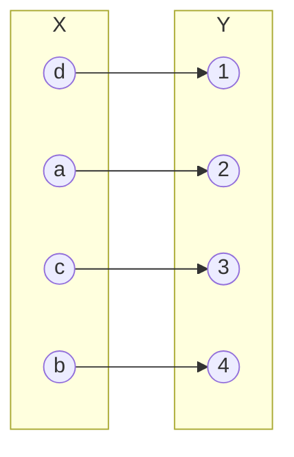

---

【范例】一一对应函数 / 双射函数

$ f $是从$ \{a, b, c, d\} $到$ \{1, 2, 3, 4\} $的函数，定义$ f(a) = 4,\ f(b) = 2,\ f(c) = 1,\ f(d) = 3 $。

函数$ f $是单射函数，因为没有两个值映射到相同的函数值。

函数$ f $是满射函数，因为陪域的个数与值域的个数相同。

因此，函数$ f $是双射函数。

---

<div style="page-break-after: always;"></div>

## 3.4 反函数

**反函数（Inverse Function）**

假设有一个从集合$ A $到集合$ B $的双射函数$ f $。由于$ f $是满射函数，所以$ B $中的每个元素都是$ A $中某些元素的像；又由于$ f $还是单射函数，所以$ B $的每个元素都是$ A $中唯一一个元素的像。

于是，通过把f的对应关系颠倒，获得的从$ B $到$ A $的新函数被称为$ f $的反函数，用$ f^{-1} $表示。当$ f(a) = b $时，$ f^{-1}(b) = a $。

需要注意，不要将$ f^{-1} $与$ 1 \over f $混淆。

---

【范例】反函数


| 是否有反函数 | $ f^{-1}(2) $ | $ f^{-1}(1) $ |
| :----------: | :-----------: | :-----------: |
|      是      |       a       |       d       |

---

【范例】计算$ f(x) = x + 3 $的反函数

$ f^{-1}(x) = x - 3 $

---

<div style="page-break-after: always;"></div>

## 3.5 合成函数

**合成函数（Composition Function）**

假设$ g $是从集合$ A $到集合$ B $的函数，$ f $是从集合$ B $到集合$ C $的函数。函数$ f $和$ g $的合成，记作$ f \circ g $。
$$
(f \circ g)(x) = f(g(x))
$$
函数合成的顺序很重要，$ f \circ g $与$ g \circ f $并不相等。

---

【范例】合成函数

$ f: \R^+ \rarr \R^+,\ f(x) = x^3 $

$ g: \R^+ \rarr \R^+,\ g(x) = x + 2 $

$ (f \circ g)(x) = f(g(x)) = (x + 2)^3 $

$ (g \circ f)(x) = g(f(x)) = x^3 + 2 $

---


**恒等函数（Identity Function）**

如果一个从集合$ A $到集合$ B $的函数$ f $有反函数，那么$ f $与$ f^{-1} $的合成函数得到的是恒等函数。

如果$ f(a) = b $，那么$ f^{-1}(b) = a $。
$$
(f \circ f^{-1})(a) = f^{-1}(f(a)) = f^{-1}(b) = a
$$

<div style="page-break-after: always;"></div>

## 3.6 指数函数与对数函数

**指数函数（Exponential Function）**

指数函数的定义为$ y = a^x\ (a > 0 | a \ne 1) $，其中$ a $称为底数（base），$ x $称为指数（exponent）。
$$
\begin{aligned}
a^m \cdot a^n &= a^{m+n} \\
a^m \over a^n &= a^{m-n} \\
(a^m)^n &= a^{mn} \\
(ab)^m &= a^m \cdot b^m
\end{aligned}
$$

---

【范例】指数函数

$ (6^{2k})^3 = 6^{6k} $

$ 6^{k^2} \times 6 = 6^{k^2 + 1} $

$ {3^k \over 9} = {3^k \over 3^2} = 3^{k-2} $

$ 3^k \times 27 = 3^k \times 3^3 = 3^{k+3} $

---


**对数函数（Logarithm Function）**

对于函数$ f: \{1, 2, 3, 4\} \rarr \{1, 4, 8, 16\},\ f(x) = 2^x $，指数函数是双射函数，因此它是有反函数的。

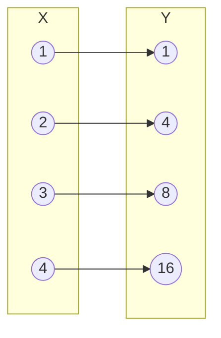

对数函数是指数函数的反函数，对数函数的定义为$ y = log_a{x}\ (a > 0 | a \ne 1) $，其中$ a $称为底数。

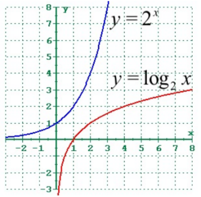
$$
\begin{aligned}
log_a{xy} &= log_a{x} + log_a{y} \\
log_a{x \over y} &= log_a{x} - log_a{y} \\
log_a{x^y} &= ylog_a{x} \\
log_a{x} &= {log_b{x} \over log_b{a}}
\end{aligned}
$$

---

【范例】对数函数

$ log_5{k} + log_5{2} = log_5{2k} $

$ log_2{5^2} = 2 \times log_2{5} $

$ {log_3{k^2} \over log_3{25}} = {2 \times log_3{k} \over log_3{5^2}} = {2 \times log_3{k} \over 2 \times log_3{5}} = log_5{k} $

---

<div style="page-break-after: always;"></div>

# 第4章 数论

## 4.1 进制转换

**进制**

日常生活中都用十进制（decimal）来表示整数，十进制数由$ 0, 1, 2, 3, 4, 5, 6, 7, 8, 9 $这10个字符组成。一个十进制整数的第$ k $位的值可以由$ 10^{k-1} $计算得到。

---

【范例】十进制
$$
\begin{aligned}
256 &= 200 + 50 + 6 \\
	&= 2 \times 10^2 + 5 \times 10^1 + 6 \times 10^0
\end{aligned}
$$

---

二进制（binary）、八进制（octal）、十六进制（hexadecimal）也是非常常用的表示法，例如计算机通常用二进制来做算术运算，而用八进制或十六进制来表示字符。

| 十进制 | 二进制 | 八进制 | 十六进制 |
| :----: | :----: | :----: | :------: |
|   0    |   0    |   0    |    0     |
|   1    |   1    |   1    |    1     |
|   2    |   10   |   2    |    2     |
|   3    |   11   |   3    |    3     |
|   4    |  100   |   4    |    4     |
|   5    |  101   |   5    |    5     |
|   6    |  110   |   6    |    6     |
|   7    |  111   |   7    |    7     |
|   8    |  1000  |   10   |    8     |
|   9    |  1001  |   11   |    9     |
|   10   |  1010  |   12   |    A     |
|   11   |  1011  |   13   |    B     |
|   12   |  1100  |   14   |    C     |
|   13   |  1101  |   15   |    D     |
|   14   |  1110  |   16   |    E     |
|   15   |  1111  |   17   |    F     |


**进制转换**

一个$ b $进制的正整数$ n $可以唯一地构造展开式：
$$
n = a^k \times b^k + a_{k-1} \times b^{k-1} + \dots + a_1 \times b^1 + a_0 \times b^0
$$

---

【范例】b进制转十进制

$ (1011)_2 = 1 \times 2^3 + 0 \times 2^2 + 1 \times 2^1 + 1 \times 2^0 = (11)_{10} $

$ (21022)_3 = 2 \times 3^4 + 1 \times 3^3 + 0 \times 3^2 + 2 \times 3^1 + 2 \times 3^0 = (197)_{10} $

---

十进制转b进制还可以使用短除法的方式。

---

【范例】十进制转b进制

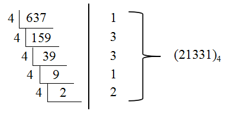

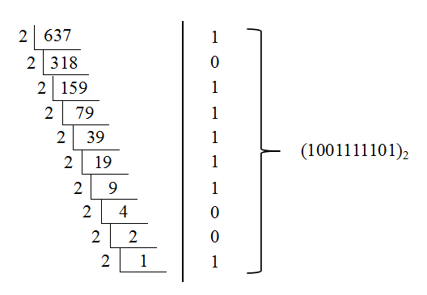

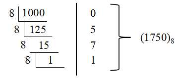

---

<div style="page-break-after: always;"></div>

## 4.2 素数

**素数（Prime Numbers）**

基于整除性的一个重要概念就是素数，素数是大于1的且不能被1和它自身以外的正整数整除的整数。素数是现代密码学中必不可少的一部分，密码学中的大素数就用在信息加密的某些方法中。

---

【范例】判断素数

7是素数，因子：1、7。

9是合数，9能被3整除。

---

每个大于$ 1 $的整数都可以唯一地写成多个素数的乘积。

---

【范例】素因子分解

$ 100 = 2 * 2 * 5 * 5 = 2^2 * 5^2 $

$ 999 = 3 * 3 * 3 * 37 = 3^3 * 37 $

$ 1024 = 2^{10} $

---

如果$ n $是一个合数，那么$ n $必有一个素因子小于或等于$ \sqrt{n} $。

---

【范例】证明101是素数

不超过$ \sqrt{101} $的素数只有$ 2, 3, 5, 7 $，因为$ 101 $不能被$ 2, 3, 5, 7 $整除，所以$ 101 $是素数。

---

【代码】素数

```python
import math

def is_prime(num):
    for i in range(2, int(math.sqrt(num)) + 1):
        if num % i == 0:
            return False
    return True

def main():
    print(is_prime(13))
    print(is_prime(18))

if __name__ == "__main__":
    main()
```

---

埃拉托斯特尼筛法（Sieve of Eratosthenes）可以用来寻找不超过一个给定整数的所有素数。

步骤：

1. 建立包含所有给定整数以内的表格。
2. 从$ i = 2 $开始。
3. 移除所有整数$ n \% i == 0 $（除$ i $以外）。
4. $ i = i + 1 $。
5. 重复第3步和第4步。

|        |   埃   |   拉   |   托   |   斯   |   特   |   尼   |   筛   |   法   |        |
| :----: | :----: | :----: | :----: | :----: | :----: | :----: | :----: | :----: | :----: |
|        | **2**  | **3**  | ~~4~~  | **5**  | ~~6~~  | **7**  | ~~8~~  | ~~9~~  | ~~10~~ |
| **11** | ~~12~~ |   13   | ~~14~~ | ~~15~~ | ~~16~~ | **17** | ~~18~~ | **19** | ~~20~~ |
| ~~21~~ | ~~22~~ | **23** | ~~24~~ | ~~25~~ | ~~26~~ | ~~27~~ | ~~28~~ | **29** | ~~30~~ |

<div style="page-break-after: always;"></div>

## 4.3 序列

**序列（Sequence）**

序列是一种用来表示有序列表的离散结构。例如$ 1, 2, 3, 5, 8 $是一个含有五项的序列，而$ 1, 3, 9, 27, 81, \dots $是一个无穷序列。序列可以用记号$ \{a_n\} $表示。

- 递增序列（increasing sequence）： 一个序列任意相邻的两项满足$ a_k < a_{k+1} $。
- 非递减序列（non-decreasing sequence）： 一个序列任意相邻的两项满足$ a_k \le a_{k+1} $。
- 递减序列（decreasing sequence）： 一个序列任意相邻的两项满足$ a_k > a_{k+1} $。
- 非递增序列（non-increasing sequence）： 一个序列任意相邻的两项满足$ a_k \ge a_{k+1} $。

---

【范例】序列

$ \{a_n\},\ a_n = {1 \over n}:\ 1, {1 \over 2}, {1 \over 3}, {1 \over 4}, \dots $

$ \{b_n\},\ b_n = 2^n:\ 1, 2, 4, 8, 16, 32, \dots $

---


**算术级数（Arithmetic Sequence）**

算术级数也称等差级数，序列形式如下：
$$
a, a + d, a + 2d, \dots, a + nd, \dots\ (a, d \in \R)
$$

---

【范例】算术级数

$ \{a_n\},\ a_n = -1 + 4n:\ -1, 3, 7, 11, \dots $

$ \{b_n\},\ b_n = 7 - 3n:\ 7, 4, 1, -2, \dots $

---


**几何级数（Geometric Sequence）**

几何级数也称等比级数，序列形式如下：
$$
a, ar, ar^2, \dots, ar^n, \dots,\ (a, r \in \R)
$$

---

【范例】几何级数

$ \{a_n\},\ a_n = (-1)^n:\ 1, -1, 1, -1, 1, \dots $

$ \{b_n\},\ b_n = -2 \times 5^n:\ 2, 10, 50, 250, 1250, \dots $

$ \{c_n\},\ c_n = 6 \times ({1 \over 3})^n:\ 6, 2, {2 \over 3}, {2 \over 9}, {2 \over 27}, \dots $

---

<div style="page-break-after: always;"></div>

## 4.4 递推关系

**递推（Recurrence）**

如果数列$ \{a_n\} $的第$ n $项与它前一项的关系可以用一个公式来表示，那么这个公式就叫做这个数列的递推方程。

算术级数的递推关系：
$$
\begin{aligned}
a_0 &= a \\
a_n &= a_{n-1} + d
\end{aligned}
$$
几何级数的递推关系：
$$
\begin{aligned}
a_0 &= a \\
a_n &= a_{n-1} \times r
\end{aligned}
$$

---

【范例】银行储蓄账户上有$ 10000 $元，年利率为$ 5.8\% $，$ 7 $年后账户中将有多少钱？
$$
\begin{aligned}
P_n &= P_{n-1} + 0.058P_{n-1} = (1.058)P_{n-1} \\
\\
P_0 &= 10000 \\
P_1 &= (1.058)P_0 \\
P_2 &= (1.058)P_1 = (1.058)^2 P_0 \\
\dots \\
P_7 & = (1.058)P_6 = (1.058)^7 P_0 \approx 14838.83
\end{aligned}
$$

---


**斐波那契数列（Fibonacci Sequence）**

斐波那契数列$ f_0,\ f_1,\ f_2,\ \dots $的递推公式为：
$$
f(n) = \left\{
\begin{aligned}
& 1 & n = 1 \\
& 1 & n = 2 \\
& f(n-1) + f(n-2) & n > 3
\end{aligned}
\right.
$$
斐波那契数列的通项公式为：
$$
f_n = {1 \over \sqrt{5}} \left({1 + \sqrt{5} \over 2} \right)^{n+1} - {1 \over \sqrt{5}} \left({1 - \sqrt{5} \over 2} \right)^{n+1}
$$

---

【代码】斐波那契数列（递归）

```c
int fibonacci(int n) {
    if(n == 1 || n == 2) {
        return 1;
    }
    return fibonacci(n-2) + fibonacci(n-1);
}
```

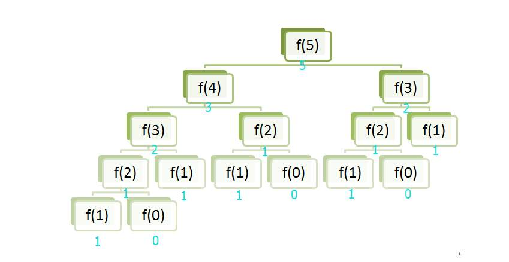

---

【代码】斐波那契数列（迭代）

```c
int fibonacci(int n) {
    int f[n];
    f[0] = f[1] = 1;
    for(int i = 2; i < n; i++) {
        f[i] = f[i-2] + f[i-1];
    }
    return f[n-1];
}
```

---

<div style="page-break-after: always;"></div>

## 4.5 求和

**求和（Summation）**

求和符号$ \sum $可以用于表示序列中所有项的累加和。
$$
\sum_{i=lower}^{upper} a_i
$$

> i：求和下标
>
> lower：下限
>
> upper：上限

---

【范例】求和
$$
\begin{aligned}
\sum_{i=1}^{100} i &= 1 + 2 +3 + \dots + 99 + 100 = 5050 \\
\sum_{j=1}^{5} j^2 &= 1^2 + 2^2 + 3^2 + 4^2 + 5^2 = 55 \\
\sum_{k=4}^{6} (-1)^k &= (-1)^4 + (-1)^5 + (-1)^6 = 1 - 1 + 1 = 1
\end{aligned}
$$

---


**双重求和**

很多情况下需要使用双重求和，比如在计算机程序中嵌套循环的分析中。

计算双重求和的方法是先展开内层求和，再继续计算外层求和。

---

【范例】双重求和
$$
\begin{aligned}
& \sum_{i=1}^{4} \sum_{j=1}^{3} ij \\
&= \sum_{i=1}^{4} (i + 2i + 3i) \\
&= \sum_{i=1}^{4} 6i \\
&= 6 + 12 + 1 8 + 24 \\
&= 60
\end{aligned}
$$

---

<div style="page-break-after: always;"></div>

## 4.6 数学归纳法

**数学归纳法（Mathematical Induction）**

数学归纳法是一种数学证明方法，通常被用于证明某个给定命题在一个给定范围内成立。

数学归纳法分为三个步骤：

1. 归纳基础
2. 归纳假设
3. 归纳递推

---

【范例】证明$ \sum_{i=1}^{n} i = {n(n+1) \over 2},\ n \in \Z^+ $
$$
\text{1. 归纳基础：当}n = 1 \\
\sum_{i=1}^{1} i = {1(1+1) \over 2} = 1 \\
\\
\text{2. 归纳假设：假设}n = k \\
\sum_{i=1}^{k} i = {k(k+1) \over 2} \text{成立} \\
\\
\text{3. 归纳递推：证明}n = k+1\text{时} \\
\sum_{i=1}^{k+1} i = {(k+1)(k+2) \over 2} \text{成立} \\
\\
\begin{aligned}
\sum_{i=1}^{k+1} i &= \sum_{i=1}^{k} i + k + 1 \\
                   &= {k(k+1) \over 2} + k + 1 \\
                   &= {k(k+1) + 2(k+1) \over 2} \\
                   &= {(k+1)(k+2) \over 2}
\end{aligned}
$$

---

【范例】证明$ 2^n \ge 3n.\ n \ge 4 $
$$
\text{1. 归纳基础：当}n = 4 \\
2^4 \ge 3 \times 4 \\
\\
\text{2. 归纳假设：假设}n = k\ (k \ge 4) \\
2^k \ge 3k \text{成立} \\
\\
\text{3. 归纳递推：证明}n = k+1\text{时} \\
2^{k+1} \ge 3(k+1) \text{成立} \\
\\
\begin{aligned}
2^{k+1} &= 2 \times 2^k \\
		&\ge 2 \times 3k \\
		&= 3k + 3k \\
		&\ge 3k + 3 \\
		&\ge 3(k+1)
\end{aligned}
$$

---

<div style="page-break-after: always;"></div>

# 第5章 计数原理

## 5.1 计数原理

**分类加法计数原理**

完成一件事有$ n $种不同的方案，其中第$ 1 $种方案有$ m_1 $种不同方法，第$ 2 $种方案有$ m_2 $种不同方法，$ \dots $，第$ n $种方案有$ m_n $种不同方法，那么完成这件事共有$ m_1 + m_2 + \dots + m_n $种不同方法。

---

【范例】从A地到B地，可以乘火车、汽车、飞机。火车有4班、汽车2班、飞机3班，那么一天中乘坐这些交通工具从A地到B地有多少种不同的走法？
$$
4 + 2 + 3 = 9
$$

---


**分步乘法计数原理**

完成一件事需要$ n $个步骤，其中第$ 1 $个步骤有$ m_1 $种不同方法，第$ 2 $个步骤有$ m_2 $种不同方法，$ \dots $，第$ n $个步骤有$ m_n $种不同方法，那么完成这件事共有$ m_1 \times m_2 \times \dots m_n $种不同方法。

---

【范例】一个书架的第1层有4本不同的计算机书，第2层有3本不同的经济书，第3层有2本不同的数学书。从书架的每一层各取一本书，有多少种不同取法？
$$
4 \times 3 \times 2 = 24
$$

---

<div style="page-break-after: always;"></div>

## 5.2 排列

**排列（Permutation）**

从$ n $个不同元素中取出$ m\ (m \le n) $ 个元素，按照一定次序排成一列，称为从$ n $个不同元素中取出$ m $个元素的一个排列。
$$
P_n^m = {n! \over (n-m)!}
$$
例如一共有8个人，A、B、C、D、E、F、G、H。现在有3个奖杯，分别为金牌、银牌和铜牌。将这3个奖牌颁发给8个人中的3个，问颁发奖牌的不同方式总共有几种？

很明显这是一个排列的问题，因为把金牌先颁给A，再把银牌颁给B，跟把金牌先颁给B，再把银牌颁给A 这是两种不同的颁奖方式。

> 第一步颁发金牌，金牌可以颁发给8个人中的1个，共有8种选择。
>
> 第二步颁发银牌，银牌可以颁发剩下7个人中的1个，共有7种选择。
>
> 第二步颁发铜牌，铜牌可以颁发剩下6个人中的1个，共有6种选择。

那么总共的颁奖方式共有$ 8 \times 7 \times 6 = 336 $种。

---

【范例】用0-9这10个数字可以组成多少个没有重复数字的三位数？

> 方法1

由于0没有排在百位上，那么百位只能是1-9这9个数字任选1个，有$ P_9^1 $种选法。

对于十位和个位，从余下的9个数字种选2个，有$ P_9^2 $种选法。

$ P_9^1 \times P_9^2 = 9 \times 9 \times 8 = 648 $


> 方法2

符合条件的三位数可以分为3大类：

1. 每一位数字都不是0的三位数，也就是从1-9中选3个，有$ P_9^3 $种选法。
2. 个位数字为0，那么需要从剩下9个数字中选2个作为十位和百位，有$ P_9^2 $种选法。
3. 十位数字为0，那么需要从剩下9个数字中选2个作为个位和百位，有$ P_9^2 $种选法。

$ P_9^3 + P_9^2 + P_9^2 = 648 $


> 方法3

利用容斥法。从0-9这10个数字任取3个数字的排列数为$ P_{10}^3 $，其中0在百位上（也就是从1-9中选2个作为十位和个位）的排列数是$ P_9^2 $。

$ P_{10}^3 - P_9^2 = 648 $

---

【代码】打印字符串"math"的全排列

```c
#include <stdio.h>
#include <string.h>

void swap(char *a, char *b) {
    char temp = *a;
    *a = *b;
    *b = temp;
}

void permutation(char *s, int start, int end) {
    if(start >= end) {
        printf("%s\n", s);
    } else {
        for(int i = start; i < end; i++) {
            swap(s + i, s + start);
            permutation(s, start + 1, end);
            swap(s + i, s + start);
        }
    }
}

int main() {
    char s[] = "math";
    int len = strlen(s);
    permutation(s, 0, len);
    return 0;
}
```

---

<div style="page-break-after: always;"></div>

## 5.3 组合

**组合（Combination）**

从$ n $个不同元素中取出$ m\ (m \le n) $ 个元素，称为从$ n $个不同元素中取出$ m $个元素的一个组合。

排列与组合的不同点在于，排列与元素的顺序有关，组合与元素的顺序无关。
$$
C_n^m = {P_n^m \over P_m^m} = {n! \over (n-m)!m!}
$$

---

【范例】在100件产品中，有98件合格品，2件次品，从这100件产品中任意抽出3件。

（1）有多少种不同的抽法？
$$
C_{100}^3 = {100 \times 99 \times 98 \over 3 \times 2 \times 1} = 161700
$$


（2）抽出的3件中恰好有1件事次品的抽法有多少种？

2件次品抽出1件有$ C_2^1 $种，再从98件合格品种抽出2件合格品有$ C_{98}^2 $种。
$$
C_2^1 \times C_{98}^2 = 9506
$$


（3）抽出的3件中至少有1件事次品的抽法有多少种？

> 方法1

恰好有1件次品有$ C_2^1 \times C_{98}^2 $种，恰好有2件次品有$ C_2^2 \times C_{98}^1 $种。
$$
C_2^1 \times C_{98}^2 + C_2^2 \times C_{98}^1 = 9604
$$

> 方法2

利用容斥法。先从100件抽出3件有$ C_{100}^3 $种，其中3件都是合格品有$ C_{98}^3 $种。
$$
C_{100}^3 - C_{98}^3 = 9604
$$

---

<div style="page-break-after: always;"></div>

## 5.4 古典概型

**古典概型**

如果一个随机试验所包含的单位事件是有限的，且每个单位事件发生的可能性均相等，则这个随机试验叫做拉普拉斯试验，这种条件下的概率模型就叫古典概型。古典概型是概率论中最直观和最简单的模型，概率的许多运算规则，也首先是在这种模型下得到的。

单位事件的特点是两两互斥的，例如抛一枚质地均匀的硬币时，正面朝上和背面朝上不会同时出现。

在古典概型中，概率的计算公式为：
$$
P(A) = {A\text{包含的单位事件个数}m \over \text{单位事件的总数}n}
$$

---

【范例】掷两个质地均匀的骰子

（1）一共有多少种不同的结果？

$ 6 \times 6 = 36 $


（2）点数之和为9的结果有多少种？

一共有4种：$ (3, 6), (6, 3), (4, 5), (5, 4) $


（3）点数之和为9的概率是多少？

$ P(A) = {4 \over 36} = {1 \over 9} $
